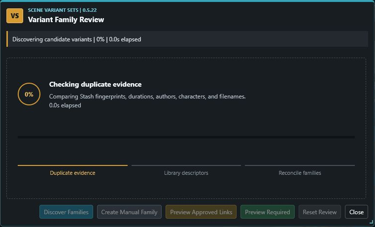
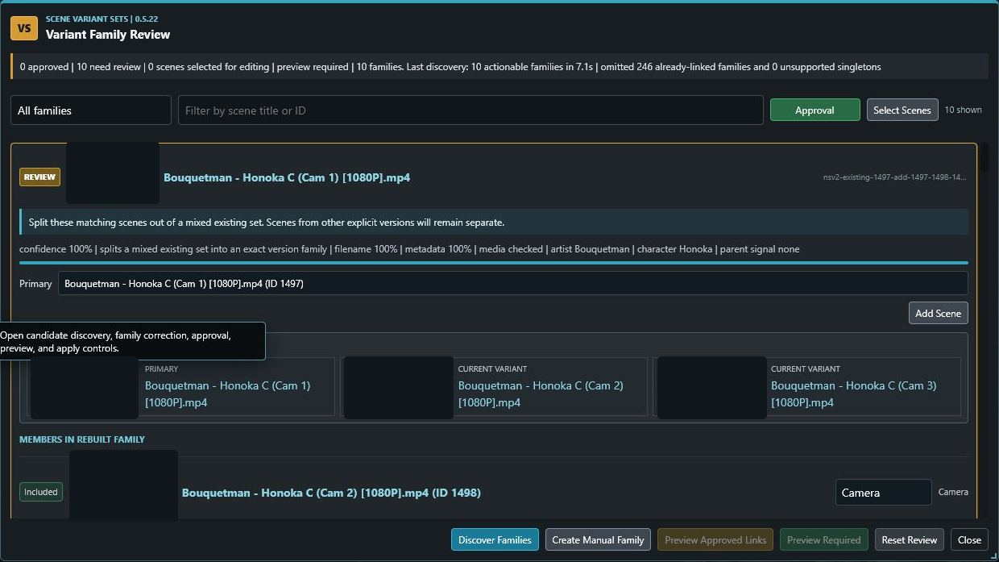
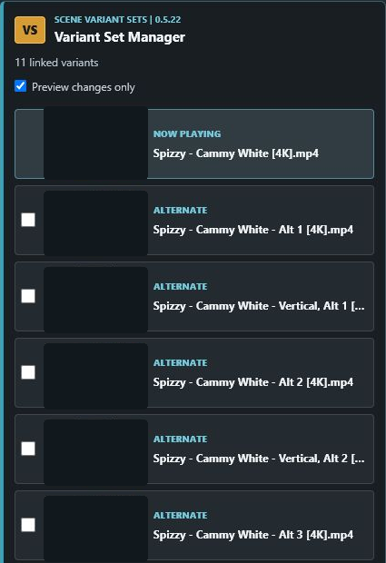
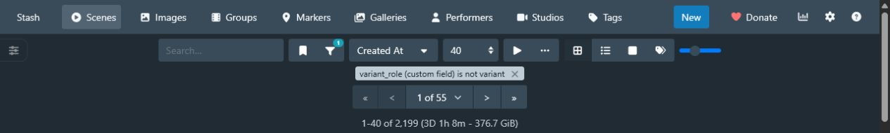

# Scene Variant Sets

Scene Variant Sets is a Stash v0.31.1 plugin for discovering, reviewing, and navigating alternate versions of the same scene without merging or deleting the underlying scene records or media files.

Version `0.5.22` combines three workflows:

- discover likely variant families using Stash duplicate fingerprints plus constrained filename and metadata evidence
- review and correct those families before applying explicit primary/child relationships
- browse, preview, queue, and promote variants directly from scene pages

The plugin also includes the original filename-driven metadata helper for mapping `franchise -> Studio`, `artist -> Group`, and `character -> Tag`.

## Feature Overview

### Assisted Variant Discovery

- Uses Stash's `findDuplicateScenes(distance, duration_diff)` result as the strict primary signal.
- Combines pHash distance, duration, dimensions, aspect ratio, filenames, Studios, Groups, Tags, and existing variant metadata.
- Keeps every proposed family constrained to one canonical artist and one complete character set.
- Recognizes variant descriptors including `Std`, `Standard`, `Default`, `Alt`, `Nude`, `Bonus`, `Loop`, `Vertical`, `Phone`, and explicit `V1`, `V2`, and later versions.
- Prefers `Std`, `Standard`, or `Default` as the parent; otherwise prefers the unnumbered original, then the lowest numbered candidate.
- Rejects unsupported title-only and numeric-only matches.
- Can suggest repairs for partial existing sets and split sets that incorrectly mix explicit versions.
- Suppresses already-linked families and unsupported one-scene suggestions from the review list.

Discovery is read-only. The review window reports measured stages and elapsed time instead of an indeterminate animation.



### Candidate Review And Correction

- Displays confidence, filename overlap, metadata overlap, media checks, artist, character, and parent-selection evidence.
- Filters candidate families by status and searches by scene title or ID.
- Approves a family by changing its `Review` status to `Approved`; bulk approval controls are also available.
- Keeps approval separate from scene selection used for editing operations.
- Supports manual family creation, adding scenes, moving selected scenes, removing mistaken members, and deleting draft families.
- Merges families through the searchable actions menu or by dragging one family card onto another.
- Allows the proposed primary and per-child labels to be corrected before apply.
- Automatically includes every scene added to a family; membership does not require a second checkbox gate.
- Persists the entire review draft in browser `localStorage`, including manual corrections and approvals.
- Shows Stash screenshots and lazy hover previews while reviewing.
- Uses a resizable, viewport-aware dialog that remembers its size and position.

Media thumbnails in this public screenshot are intentionally masked; the live UI uses Stash's generated screenshots and previews.



### Dry-Run-First Apply

- Requires an explicit dry-run preview before `Create Variant Sets` is enabled.
- Invalidates the previous dry-run whenever the draft is edited.
- Applies only approved families.
- Reuses the existing link, move, rebuild, and promote operations instead of maintaining a second relationship model.
- Provides graph validation and plugin-owned metadata rollback tasks.
- Never merges scene files, deletes scenes, moves media, or writes directly to SQLite.

Applied relationships use these Stash custom fields:

- `variant_role`
- `variant_set_id`
- `variant_children`
- `variant_parent_id`
- `variant_label`
- `variant_sort_index`

### Scene Player Variant Manager

- Appears on every parent or child scene in an applied family.
- Keeps the complete family visible when navigating from one variant to another.
- Sorts the primary first and numbered variants in numeric order.
- Shows generated thumbnails with Stash's multi-frame hover previews.
- Selects individual variants or queues all other variants through the optional Session Scene Queue companion plugin.
- Promotes any child with `Make Set Primary`, swapping it with the old primary without dropping family members or labels.
- Supports attach, nest, unlink, rename, reorder, rebuild, and validation operations.
- Starts expanded and collapses behind a full-width chevron.
- Provides mouse and keyboard tooltips for plugin controls.

Media thumbnails are masked below; titles, roles, queue selection, and manager layout are unchanged.



### Scenes Page Integration

- Hides nested child variants by default so browsing emphasizes primary scenes.
- Adds `Show nested variants` / `Hide nested variants` to the Scenes toolbar ellipsis menu.
- Uses Stash's native `custom_fields.variant_role != variant` query before pagination.
- Preserves accurate totals, configured page sizes, search criteria, sorting, and unrelated filters.
- Adds a compact variant dropdown to primary scene cards instead of overlaying the thumbnail.

The active native filter remains visible in Stash, and a 40-scene page remains a truthful 40-scene page.



### Filename Metadata Helper

- Parses standardized filenames to identify franchise, artist, and canonical characters.
- Adds or reuses Stash Studios, Groups, and Tags according to configured safety settings.
- Merges helper tags with existing tags instead of replacing unrelated metadata.
- Supports aliases and dry-run output for ambiguous mappings.
- Does not use Performers for artist metadata.

## Typical Workflow

1. Open a scene page and choose **Review Candidate Families**, or run **Variant Sets: Discover Candidate Variants** from Settings -> Tasks.
2. Let the read-only discovery stages finish.
3. Review evidence, correct primary choices or membership, and approve the desired families.
4. Choose **Preview Approved Links** and inspect the Stash task log.
5. Choose **Create Variant Sets** only after the preview is ready.
6. Use **Validate variant graph** after a large batch.

## Safety Defaults

- `dryRun: true`
- `createMissingTags: false`
- `createMissingGroups: false`
- `createMissingStudios: false`
- `allowOverwrite: false`
- `variantScanLimit: 0`, so validation and rollback scan every variant page
- `variantDiscoveryDistance: 4`
- `variantDiscoveryDurationDiff: 2`
- `variantDiscoveryLimit: 200`
- no automatic scene-create hook
- no draft candidate fields written to scenes
- no file deletion, movement, merge, or direct SQLite access

## Installation

Copy the plugin folder to Stash's plugin directory and reload plugins. Keep the manifest filename as `scene-metadata-variants-v1.yml`; Stash uses that filename as the plugin ID.

The queue controls require the optional `Session Scene Queue` plugin version `1.2.0` or later. Discovery, review, linking, thumbnails, sorting, and player navigation work without it.

See [INSTALL.md](INSTALL.md) for the complete installation and configuration steps.

## Repository Guide

- `scene-metadata-variants-v1.yml` - Stash manifest, settings, tasks, and UI assets
- `scene-metadata-variants.js` - embedded task engine and shared discovery logic
- `ui/scene-variants.js` - scene manager, browse integration, and candidate review UI
- `ui/scene-variants.css` - plugin styling
- `tests/run-tests.js` - mock GraphQL regression suite
- `GRAPHQL.md` - GraphQL operations and schema assumptions
- `TESTING.md` - automated and manual verification
- `USER_GUIDE.md` - detailed user workflow
- `ROLLBACK.md` - rollback and recovery procedures
- `CHANGELOG.md` - version history

## Verification

The current suite covers discovery grouping, parent selection, identity boundaries, existing-family repair, dry-run safety, apply confirmation, primary promotion, browse filtering, browser-local discovery loading, and UI source contracts.

Run:

```powershell
node --check scene-metadata-variants.js
node --check ui/scene-variants.js
node tests/run-tests.js
```

The installed `0.5.22` build passes all 51 tests and has been verified against the live Stash v0.31.1 GraphQL endpoint.
